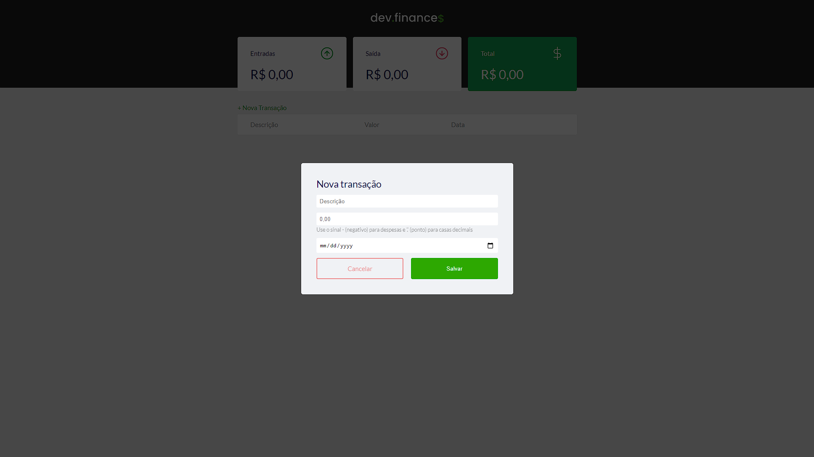
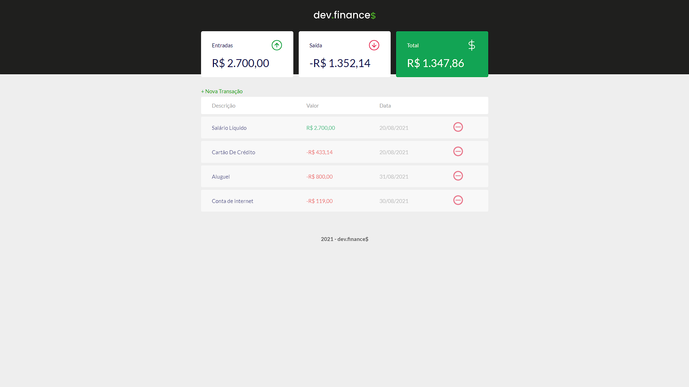

# 
# Project-Finance - Aplicação web que calcula entradas e saídas monetárias

## Visão geral

### O desafio

- Construir um site que se adapte aos vários tamanhos de tela (responsividade)
- Utilizar funções usando JavaScript
- Uso de pseudo-elements em CSS3
- Construir Layouts com Grid e/ou flexbox

### Página Inicial
             

### Modal para adicionar Entradas ou Saídas
 
### Página em funcionamento
 
 ### Responsividade na prática
 
   

### Construído com

- Marcação HTML5 semântica
- Propriedades personalizadas CSS
- Flexbox
- CSS Grid
- Funções em JavaScript

### O que eu aprendi

- Prática de DOM (Document Object Model)
- Formulários HTML
- Criação de um site responsivo usando o conceito de Mobile-First
  
    
