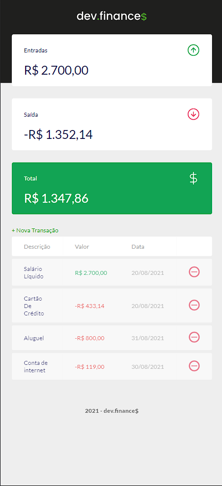

<h1 align="center">
  
</h1>

  <a href="#-tecnologias">Tecnologias</a>&nbsp;&nbsp;&nbsp;|&nbsp;&nbsp;&nbsp;
  <a href="#-projeto">Projeto</a>&nbsp;&nbsp;&nbsp;|&nbsp;&nbsp;&nbsp;
  <a href="#-layout">Layout</a>&nbsp;&nbsp;&nbsp;

## 💻 Projeto

O devFinances tem o objetivo de fazer cálculos monetários de uma forma intuitiva para ajudar o usuário a ter um controle de entradas e saídas em um período de tempo em que ele define.

## 🔖 Layout

Você pode visualizar o projeto em funcionamento através [desse link](https://joaovsz.github.io/Project-Finance/).

---

Feito com ♥ by JoãoVitor :wave: [Fale comigo!](mailto:joaovitor1713coin@gmail.com)
